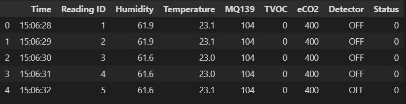
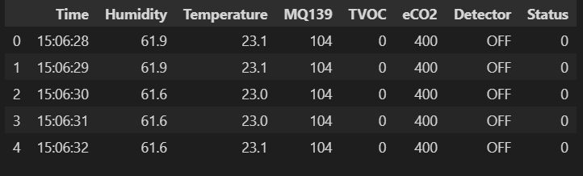
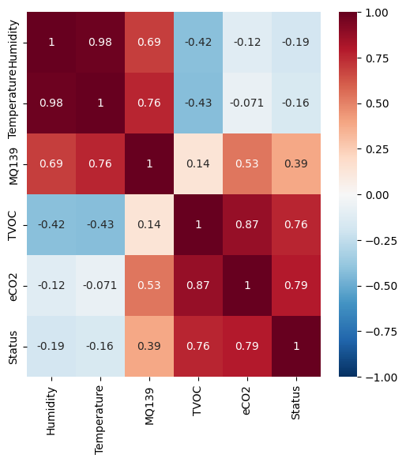
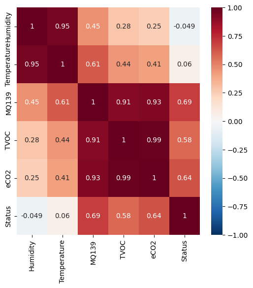
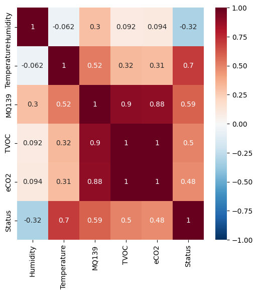

# 数据分析作业

引用库，打开相关文件

```python
import pandas  as pd
import numpy   as np
import matplotlib.pyplot as plt
import seaborn as sns
df1 = pd.read_csv("./csv/carton_1.csv")
df2 = pd.read_csv("./csv/carton_2.csv")
df3 = pd.read_csv("./csv/clothing_1.csv")
df4 = pd.read_csv("./csv/clothing_2.csv")
df5 = pd.read_csv("./csv/electrical_1.csv")
df6 = pd.read_csv("./csv/electrical_2.csv")
df7 = pd.read_csv("./csv/electrical_3.csv")
df8 = pd.read_csv("./csv/electrical_4.csv")
df_serise=[df1,df2,df3,df4,df5,df6,df7,df8]#批量化处理
```

## 数据初筛

由于列表名不一致，对此进行修改（以表8为例）

```python
df_serise=[df1,df2,df3,df4,df5,df6,df7,df8]
for x in df_serise:
    x.columns=['Time','Reading ID','Humidity','Temperature','MQ139','TVOC','eCO2','Detector','Status']
df8.head(5)
```

表格预览



### 无关数据删除

粗咯上看，没有数据异常，但Reading ID这列是无关数据，需删除（以表8为例）

```python
for x in df_serise:
    del x['Reading ID']
df8.head(5)
```



对空数据统计

```python
for x in df_serise:
    print(sum(x.isnull().sum()))
```

输出均为0表明所有表中无空数据

### 数据按类整合

```python
carton = pd.concat([df1,df2],axis = 0,ignore_index = 1)
carton = pd.concat([df1,df2],axis = 0,ignore_index = 1)
electrical = pd.concat([df5,df6,df7,df8],axis = 0,ignore_index = 1)
```

数据目前只包含在这三个csv文档中

## 分析carton主体

### 相关性分析（carton）

```python
# 相关分析热力图可视化
plt.figure(figsize=[6, 6])
sns.heatmap(carton.corr(), vmin=-1, vmax=1, cmap="RdBu_r",center=0, linewidths=0.5)
plt.show()
```

  
通过相关性分析可知(以>0.75为可能相关)  
Humidity-Temperature  
MQ139-Humidity  
MQ139-Temperature  
eco2-TVOC  
status-eco2  
status-TVOC  
这几组数据具有相关性，以下是对具体数据的分析：

#### Humidity-Temperature(carton)

```python
plt.scatter(carton.Humidity, carton.Temperature, c='red',s=0.1)  # 虚线, 星点, 红色
plt.xlabel("Humidity")
plt.ylabel("Temperature")
plt.show()
```

.png)  
可以看出同样是carton类，对于温度和湿度的条件差异较大  
但两者在测量环境下都呈现出温度升高而湿度降低

### MQ139-Humidity(carton)

.png)  
这里可以明显看出湿度较低时，氟利昂含量较低但随湿度增加而迅速增加。  
当湿度较高时湿度反而不是氟利昂含量增长的主要因素

### MQ139-Temperature(carton)

.png)  
温度较低时，氟利昂含量较低但随温度增加均匀减少。  
当温度较高时随温度增加氟利昂含量迅速增长

### eco2-TVOC(carton)

```python
plt.scatter(df1.TVOC, df1.eCO2, s=1,c='red',)  # 虚线, 星点, 红色
plt.scatter(df2.TVOC, df2.eCO2, s=1,c='blue',)  # 虚线, 星点, 蓝色
plt.xlabel("TVOC")
plt.ylabel("eco2")
```

.png)  
从表中可以看出TVOC与co2含量大致成正相关

### status-eco2 & status-TVOC

## 总结carton

可以看出与CO2浓度直接相关的是氟利昂含量，同时氟利昂含量受温度和湿度双重影响  
温度，湿度较低时，随温度增加，湿度降低，氟利昂含量降低  
温度，湿度较高时，随温度增加，湿度降低，氟利昂含量迅速增加  
结合eco2和TVOC的比率关系，从减少氟利昂含量角度考虑，我们应该选择纸类产品2（蓝线）  
但我们同样可以看出在产生相同氟利昂的情况下产品2会产生更多的CO2，同样不利于减碳

## 建议carton

根据需控制的TVOC以及CO2含量对需求纸类产品量进行合理划分  
低温生产

## 分析clothing主体

### 相关性分析(clothing)

  
通过相关性分析可知(以>0.75为可能相关)  
Humidity-Temperature  
MQ139-TVOC
MQ139-eCO2
eco2-TVOC  
这几组数据具有相关性，以下是对具体数据的分析：

### Humidity-Temperature(clothing)

.png)  

可以看出同样是clothing类，对于温度和湿度的条件差异较大  
温度较低时在测量环境下呈现出温度升高而湿度降低，当湿度较大时，温度对湿都影响小

### MQ139-TVOC(clothing)

.png)  
温度较低时，产品1产生空气污染含量较低但随温度增加均匀减少。  
当温度较高时随温度增加氟利昂含量迅速增长

### MQ139-eCO2(clothing)

.png)  
可以看出来，氟利昂和co2含量大致成阶梯式增长拐点大致位于（220，2000）  
（350，25000）和 （420，29000）处  
（0，220）阶段：eCO2随氟利昂含量增加迅速增加  
（220，350）阶段：eCO2随氟利昂含量增加大致成log函数增加，在350处增速放缓  
（350，420）阶段：eCO2随氟利昂含量增加陡然增加
（420——  ）阶段：eCO2随氟利昂含量增加而平稳增加，增速在所有阶段中最慢

### eco2-TVOC(clothing)

.png)  
两者大致成正比例增加，但在（35000-——  ）阶段随空气污染量的增加凑CO2含量没有明显增加

## 总结clothing

## 建议cloyhing

从减排角度，应该控制生产衣物氟利昂总量在300-350，在这个范围CO2尚未迅速增加且体量较小，利于环保。  
低温生产

## 分析主体electrical

### 相关性分析(electrical)

  
通过相关性分析可知(以>0.75为可能相关)  
MQ139-TVOC  
MQ139-eCO2  
eco2-TVOC  
这几组数据具有相关性，以下是对具体数据的分析：

## MQ139-TVOC(electrical)

.png)  
阶段一（0-250）：开始平稳  
阶段二（250—）：指数增长

## MQ139-eCO2(electrical)

.png)  
阶段一（0-250）：开始平稳  
阶段二（250—）：指数增长

## eco2-TVOC(electrical)

.png)  
两者成正比例

## 总结(electrical)

对于电子电器产业而言，氟利昂含量的排出即排碳直接与空气污染向挂钩。

## 建议(electrical)

控制氟利昂排放量（200-259），此阶段排碳量较少，且TVOC/MQ139比率较低，对环境影响较小

## 总结

从空气污染物转化率的角度来说carton污染程度较高  
而clothing呈现明显的阶梯性，最好的方案是控制衣物产业的产出，将其控制在下一阶梯前抑制其迈入下一级所带来的排碳量突增  
electrical产业成指数性，可以控制其排出量（200-259），减小影响
